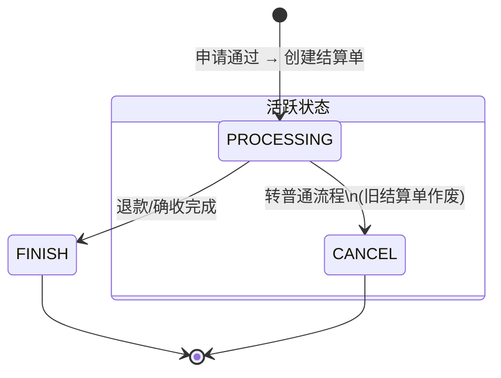
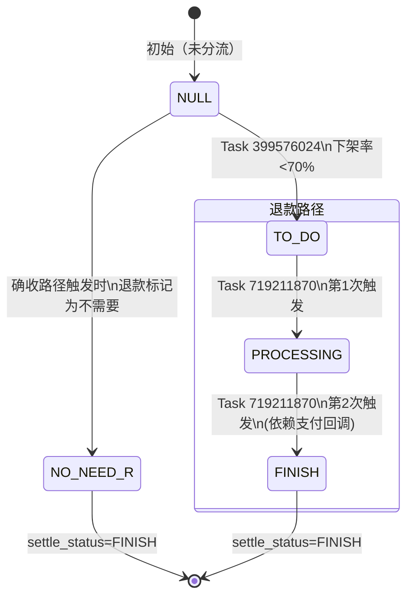
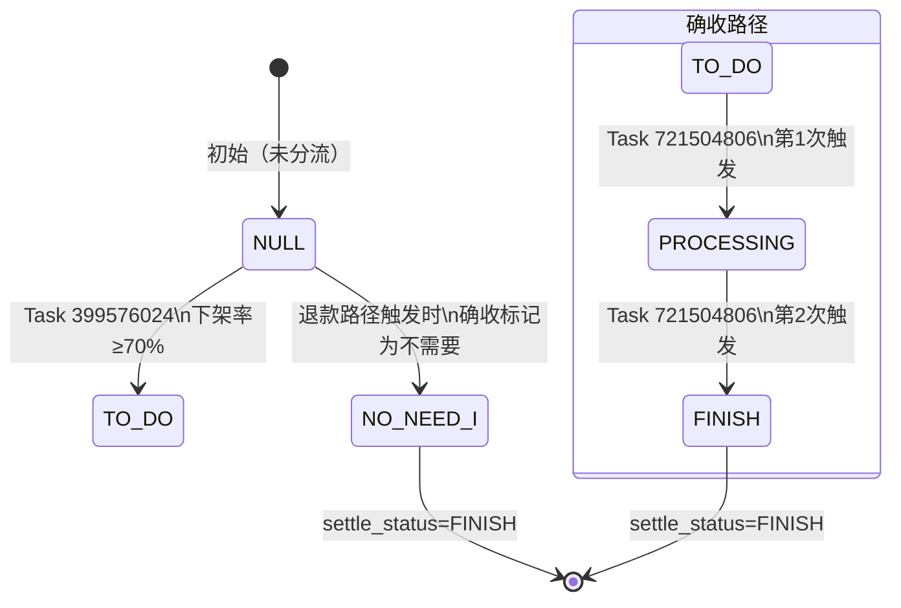
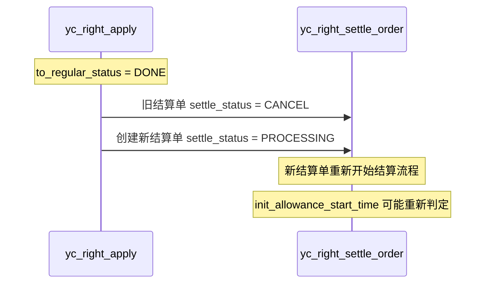

# 结算状态机

## settle_status 主状态



| 状态 | 含义 | 后续流转 |
|------|------|----------|
| PROCESSING | 结算进行中 | → FINISH（退款/确收完成）或 → CANCEL（转普通） |
| CANCEL | 已取消（转普通导致） | 终态，新结算单被创建 |
| FINISH | 已完结 | 终态 |
| **NO_NEED** | **不需要（对侧路径已触发）** | **终态** — 如确收路径触发时退款子状态标记为 NO_NEED |

> **FINISH_STATUS_LIST** = {FINISH, NO_NEED}（源码 `SettleStatusEnum.java`）。两个值均视为终态，Job 查询时会跳过这些状态。

## 退款子状态 (serv_finish_refund_status)



| 子状态 | 含义 | 触发方式 | 预期次数 |
|--------|------|----------|----------|
| NULL | 未进入退款路径 | 初始 | — |
| TO_DO | 待退款（已分流） | Task 399576024 扫描后自动设置 | 1次 |
| PROCESSING | 退款处理中 | Task 719211870 第1次 | 1次 |
| FINISH | 退款完成 | Task 719211870 第2次 | 可能需多次（依赖支付回调） |
| **NO_NEED** | **不需要退款** | **确收路径触发时自动设置** | **终态 — FINISH_STATUS_LIST 成员** |

## 确收子状态 (serv_finish_income_status)



| 子状态 | 含义 | 触发方式 | 预期次数 |
|--------|------|----------|----------|
| NULL | 未进入确收路径 | 初始 | — |
| TO_DO | 待确收（已分流） | Task 399576024 扫描后自动设置 | 1次 |
| PROCESSING | 确收处理中 | Task 721504806 第1次 | 1次 |
| FINISH | 确收完成 | Task 721504806 第2次 | 可能需多次 |
| **NO_NEED** | **不需要确收** | **退款路径触发时自动设置** | **终态 — FINISH_STATUS_LIST 成员** |

## SchedulerX Job 链

| 执行顺序 | Task ID | 类名 | Cron | 作用 | 前置依赖 |
|----------|---------|------|------|------|----------|
| 1 | 715618497 | — | 01:00 | 首发补贴退款 | 无 |
| 2 | 399576024 | RightProtectExpiredJob | 02:00 | 扫描过期right → 分流 | protect_expire_time已过期 |
| 3a | 719211870 | ServFinishRefundJob | 04:00 | 退款（下架率<70%） | Task 399576024已执行 |
| 3b | 721504806 | ServFinishIncomeJob | 06:00 | 确收（下架率≥70%） | Task 399576024已执行 |

**注意**：
- 3a 和 3b 互斥，同一结算单只会走其中一条路径
- Job 按 cron 时间顺序执行，不能乱序
- 每个 Job 可能需要多次触发才能推进状态

## 转普通流程对结算单的影响



## 状态互斥规则

| 规则 | 说明 |
|------|------|
| refund 和 income 互斥 | 同一结算单只能走一条路径，另一条标记为 NO_NEED |
| NO_NEED 是终态 | 属于 FINISH_STATUS_LIST，与 FINISH 等价；Job 查询时自动跳过 |
| CANCEL 后重建 | 转普通时旧单 CANCEL，新单 PROCESSING |
| FINISH/NO_NEED 不可逆 | 一旦到终态不能回退 |
| settle_status=FINISH 需子状态先到终态 | 主状态跟随子状态（FINISH 或 NO_NEED） |

## 已验证状态流转（实测数据）

### apply_id=200000885（退款路径，非首发）

```
基线: right_status=YC_PROTECTING, settle_status=PROCESSING, refund=NULL, income=NULL
  ↓ Task 399576024
Step2: right_status=YC_PROTECT_INVALID, refund=TO_DO, income=NULL
  ↓ Task 719211870 第1次
Step3a: refund=PROCESSING
  ↓ Task 719211870 第2次
Step3b: refund=FINISH, settle_status=FINISH
```

### apply_id=200001005（退款路径，首发，有补贴）

```
基线: right_status=YC_PROTECTING, settle_status=PROCESSING, refund=NULL, income=NULL
  init_allowance_start_time=2026-07-07, 侵权记录=0条(下架率0%)
  ↓ Task 399576024
Step2: right_status=YC_PROTECT_INVALID, refund=TO_DO, income=NULL
  ↓ Task 719211870 第1次
Step3a: refund=PROCESSING
  ↓ Task 719211870 第2次
Step3b: refund=FINISH, settle_status=FINISH, refund_amount=2分
```

### 确收路径（未验证）

预期流转：
```
基线: right_status=YC_PROTECTING, settle_status=PROCESSING, refund=NULL, income=NULL
  ↓ Task 399576024 (下架率≥70%)
Step2: right_status=YC_PROTECT_INVALID, refund=NO_NEED, income=TO_DO
  ↓ Task 721504806 第1次
Step3a: income=PROCESSING
  ↓ Task 721504806 第2次
Step3b: income=FINISH, settle_status=FINISH, income_amount=Switch配置值
```

## DB 验证 SQL

```sql
-- 查完整子状态
SELECT id, settle_status,
       serv_finish_refund_status, serv_finish_refund_amount,
       serv_finish_income_status, serv_finish_income_amount,
       total_amount, init_allowance_start_time, init_allowance_amount
FROM yc_right_settle_order
WHERE right_apply_id = {applyId} AND env = 'staging'
AND settle_status != 'CANCEL'
ORDER BY id DESC LIMIT 1;

-- 查侵权记录计算下架率
SELECT status, COUNT(*) AS cnt
FROM yc_tort_record
WHERE right_id = {rightId} AND env = 'staging'
GROUP BY status;
```
