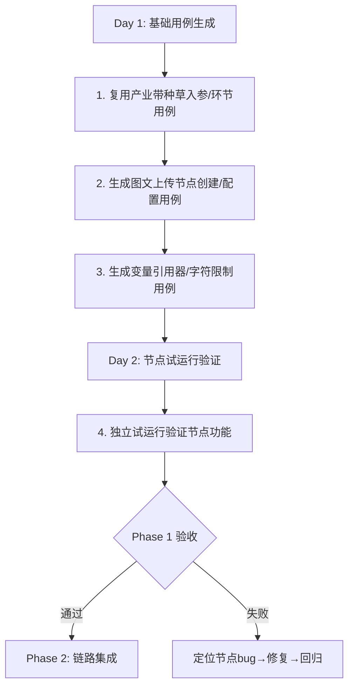
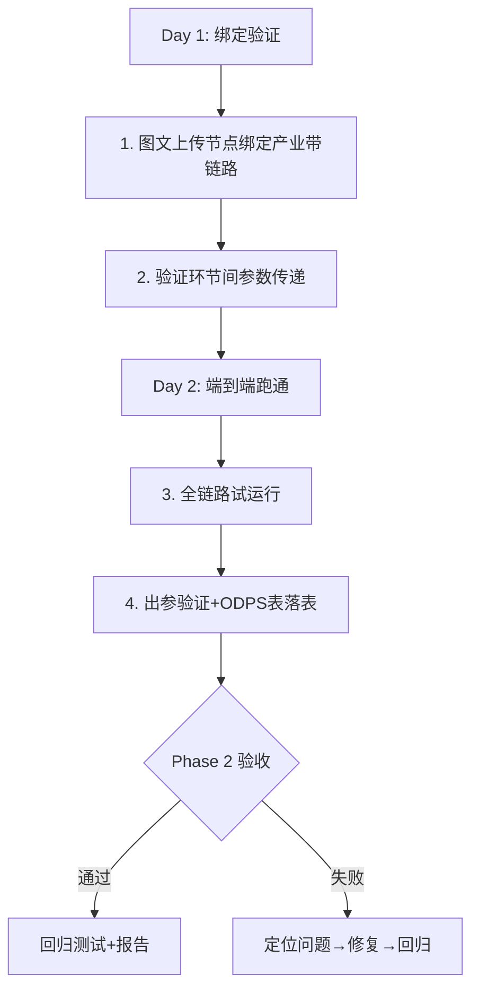

# F88产业带种草链路测试报告

> **文档来源**：https://alidocs.dingtalk.com/i/nodes/MNDoBb60VLYDGNPytBmXge05JlemrZQ3  
> **PRD版本**：产业带种草产品需求（产业带GMV TOP5%爆品种草素材生产链路）  
> **报告日期**：2026-07-07  
> **测试负责人**：AI Test Harness  

---

## 1 需求概览

### 1.1 核心目标
产业带GMV TOP5%爆品种草素材的全自动化生产链路改造，涵盖：
- **准备生产物料**：商品数据源、构图标过滤、视觉模板召回
- **启动生产**：优先级排序、定时器调度、疲劳度去重
- **素材自动上传**：新增「图文上传」节点至纵横平台

### 1.2 链路定位
- **优先级**：低于线上其他链路（低优先级链路）
- **生产模式**：F88_STREAM 流式生产
- **定时器**：每1小时查询一次，周末及节假日不关闭

---

## 2 需求项逐句映射测试

### 2.1 准备生产物料

| PRD章节 | 需求描述 | 可测性 | 验证方式 | 风险等级 |
|---------|----------|--------|----------|----------|
| 2.1 | 商品数据来源：产业带GMV TOP5%爆品 | ❌ 纯后端 | ODPS表验证 | 高风险 |
| 2.1 | 过滤条件：模版数量>50的类目 | ❌ 纯后端 | DB断言 | 中风险 |
| 2.1 | 过滤条件：无SA千牛商家素材 | ❌ 纯后端 | DB断言 | 中风险 |
| 2.1 | 过滤条件：信息流可分发状态 | ❌ 纯后端 | DB断言 | 中风险 |
| 2.1 | 过滤条件：剔除异常订单(search_sentry.fushi_baopin_risk_item) | ❌ 纯后端 | ODPS表验证 | 高风险 |
| 2.2 | 优先级一：构图识别去劣+择优+3:4 | ❌ 纯后端 | API断言 | 中风险 |
| 2.2 | 优先级二：构图识别去劣+择优(真人/平铺/挂拍)+3:4 | ❌ 纯后端 | API断言 | 中风险 |
| 2.2 | 优先级三：构图识别去劣(简化)+3:4 | ❌ 纯后端 | API断言 | 中风险 |
| 2.2 | 优先级四：构图识别去劣(简化)+1:1 | ❌ 纯后端 | API断言 | 中风险 |
| 2.3 | 拍立淘方式召回6个模板(ind_std_plat.f88_template) | ❌ 纯后端 | API断言 | 中风险 |
| 2.4 | 交付表结构：12字段(item_id/seller_id/pic_url/tao_cate/template_1~6/order_quantity) | ❌ 纯后端 | ODPS表验证 | 中风险 |

**结论**：准备生产物料阶段 **全部为后端逻辑**，无UI可测点。需通过ODPS表查询+API断言验证。

---

### 2.2 启动生产

| PRD章节 | 需求描述 | 可测性 | 验证方式 | 风险等级 |
|---------|----------|--------|----------|----------|
| 3.1 | 商品优先级：按order_quantity降序 | ❌ 纯后端 | 数据验证 | 中风险 |
| 3.2 | 定时器：每1小时查询，队列<2000则补充(2000-n)/6 | ❌ 纯后端 | 后端日志 | 高风险 |
| 3.3 | 疲劳度：已生产过的itemid不重复生产 | ❌ 纯后端 | DB断言 | 高风险 |
| 3.4 | 链路优先级：低于线上其他链路 | ❌ 纯后端 | 调度系统日志 | 中风险 |
| 3.5 | 链路入参字段：10个(item_id/seller_id/tao_cate/seed_image_url/template_1~6) | ✅ **UI可测** | 链路详情/环节参数弹窗验证 | **低** |

**✅ 新增UI可测用例需求**：

| 用例ID | 验证点 | 优先级 |
|--------|--------|--------|
| `atomic_f88_industry-seeding-params` | 验证链路起点入参10字段（template_1~6新增） | P1 |
| `atomic_f88_industry-seeding-stages` | 验证环节结构（与种草20205的差异） | P1 |
| `atomic_f88_industry-seeding-page-load` | 验证产业带种草链路详情页加载 | P2 |

---

### 2.3 素材自动上传（新增节点）

| PRD章节 | 需求描述 | 可测性 | 验证方式 | 风险等级 |
|---------|----------|--------|----------|----------|
| 4 | 新增「图文上传」节点 | ✅ **UI可测** | 节点类型列表+策略创建 | **低** |
| 4 | 上传类型：种草图文——达人账号 | ✅ **UI可测** | 节点表单下拉选项 | **低** |
| 4 | 商品ID：引用变量 | ✅ **UI可测** | 节点表单变量选择器 | **低** |
| 4 | 达人账号ID：手动填写(多账号逗号分隔) | ✅ **UI可测** | 节点表单输入框+校验 | **低** |
| 4 | 图片list：引用变量 | ✅ **UI可测** | 节点表单变量选择器 | **低** |
| 4 | 内容标题：≤20字符+引用变量 | ✅ **UI可测** | 节点表单输入框+字符数限制 | **低** |
| 4 | 内容文案：≤1000字符+引用变量 | ✅ **UI可测** | 节点表单textarea+字符数限制 | **低** |
| 4 | 服务端写入纵横平台 | ❌ 纯后端 | API/回调验证 | 高风险 |
| 4 | 数据落ODPS表：5字段(入参/内容id/状态/失败原因/时间) | ❌ 纯后端 | ODPS表验证 | 高风险 |

**✅ 新增节点级用例需求（Phase 1）**：

| 用例ID | 验证点 | 优先级 |
|--------|--------|--------|
| `atomic_f88_node_image-text-upload-create` | 图文上传节点创建+表单渲染 | P1 |
| `atomic_f88_node_image-text-upload-config` | 节点配置字段完整性(6字段) | P1 |
| `atomic_f88_node_image-text-upload-var-binding` | 变量引用器(商品ID/图片list/标题/文案) | P1 |
| `atomic_f88_node_image-text-upload-validation` | 字符数限制(标题≤20/文案≤1000) | P2 |
| `atomic_f88_node_image-text-upload-trial-run` | 图文上传节点试运行(独立验证) | P1 |

**✅ 新增链路级用例需求（Phase 2）**：

| 用例ID | 验证点 | 优先级 |
|--------|--------|--------|
| `atomic_f88_link_industry-seeding-upload-integration` | 图文上传节点绑定到产业带链路 | P1 |
| `atomic_f88_link_industry-seeding-e2e` | 产业带种草端到端验证(物料→生产→上传) | P1 |

---

## 3 现有用例覆盖度分析

### 3.1 已有用例（种草20205）

| 用例ID | 文件 | 验证范围 | 是否可复用 |
|--------|------|----------|------------|
| `atomic-f88-seeding-page-load` | 链路管理 | 链路详情加载 | ✅ 可复制改造 |
| `atomic-f88-seeding-stages` | 策略管理 | 6环节卡片结构 | ✅ 可复制改造 |
| `atomic-f88-seeding-params` | 策略管理 | 起点入参5字段+各环节出入参 | ⚠️ 需扩展template_1~6 |
| `atomic-f88-seeding-strategy-interaction` | 策略管理 | 策略策略操作交互 | ✅ 可复制改造 |
| `atomic-f88-seeding-trial-run` | 策略管理 | 试运行弹窗 | ✅ 可复制改造 |
| `atomic-f88-seeding-pipeline-output` | 策略管理 | 全链路出参验证 | ✅ 可复制改造 |
| `atomic-f88_seeding-negative-feedback` | 审核管理 | 负反馈按钮 | ⚠️ 审核逻辑相同可复用 |
| `atomic-f88_seeding-task-type-label` | 审核管理 | 任务类型备注 | ⚠️ 审核逻辑相同可复用 |
| `atomic-f88_seeding-production-priority` | 审核管理 | 生产优先级 | ⚠️ 审核逻辑相同可复用 |

### 3.2 复用策略

```
现有种草20205用例 → 产业带种草链路
├── 可直接复制改造（3个）
│   ├── page-load → 验证产业带链路详情页
│   ├── stages → 验证环节结构(可能不同)
│   └── trial-run → 验证试运行弹窗
│
├── 需扩展现有字段（1个）
│   └── params → 入参从5字段扩至10字段(+template_1~6)
│
├── 审核逻辑可复用（3个）
│   ├── negative-feedback → 负反馈按钮(审核逻辑不变)
│   ├── task-type-label → 任务类型备注(审核逻辑不变)
│   └── production-priority → 生产优先级(审核逻辑不变)
│
└── 需新建节点级+链路级（6个）
    ├── 节点级(5个) → 图文上传节点独立验证
    └── 链路级(1个) → 产业带种草端到端
```

---

## 4 缺失用例清单与生成优先级

### 4.1 Phase 1: 节点先行（优先级最高）

| # | 用例ID | steps | 验证维度 | 生成难度 |
|---|--------|-------|----------|----------|
| 1 | `atomic_f88_industry-seeding-params` | 25 | 入参10字段验证(template_1~6新增) | 低(可复用) |
| 2 | `atomic_f88_industry-seeding-stages` | 20 | 环节结构验证 | 低(可复用) |
| 3 | `atomic_f88_node_image-text-upload-create` | 30 | 图文上传节点创建+表单渲染 | 中(新建) |
| 4 | `atomic_f88_node_image-text-upload-config` | 35 | 6配置字段完整性 | 中(新建) |
| 5 | `atomic_f88_node_image-text-upload-var-binding` | 25 | 变量引用器验证 | 中(新建) |
| 6 | `atomic_f88_node_image-text-upload-validation` | 20 | 字符数限制验证 | 低(新建) |
| 7 | `atomic_f88_node_image-text-upload-trial-run` | 25 | 节点试运行独立验证 | 中(新建) |

### 4.2 Phase 2: 链路集成（节点验证通过后）

| # | 用例ID | steps | 验证维度 | 生成难度 |
|---|--------|-------|----------|----------|
| 8 | `atomic_f88_industry-seeding-upload-integration` | 30 | 图文上传节点绑定到产业带链路 | 中 |
| 9 | `atomic_f88_link_industry-seeding-e2e` | 40 | 端到端(物料→生产→上传→回源) | 高 |

### 4.3 后端Gap（需开发配合）

| # | 验证点 | 验证方式 | 风险等级 |
|---|--------|----------|----------|
| 1 | 商品来源过滤(ODPS表) | 数据查询脚本 | 高 |
| 2 | 构图优先级规则(API) | 接口断言 | 中 |
| 3 | 拍立淘模板召回(6个) | 接口断言 | 中 |
| 4 | 疲劳度(已生产不重复) | DB断言 | 高 |
| 5 | 定时器调度(2000上限) | 后端日志 | 高 |
| 6 | 纵横平台写入 | API回调验证 | 高 |
| 7 | ODPS表落表(5字段) | 数据查询脚本 | 高 |

---

## 5 风险评估与缓解措施

### 5.1 高风险项

| 风险 | 影响 | 缓解措施 |
|------|------|----------|
| 疲劳度逻辑失效 | 商品重复生产，浪费资源 | 增加DB断言用例+日志监控 |
| 定时器调度异常 | 队列积压或产能不足 | 后端日志告警+定时监控脚本 |
| 纵横平台写入失败 | 素材无法触达信息流 | 回调重试机制验证+ODPS表监控 |
| 优先级排序错误 | 爆品素材无法优先生产 | 数据排序断言用例 |

### 5.2 中风险项

| 风险 | 影响 | 缓解措施 |
|------|------|----------|
| 构图优先级过滤失效 | 劣质图片进入生产 | 构图识别API回归测试 |
| 拍立淘模板召回不足 | 模板数量<6 | 模板库数据校验用例 |
| 字符数限制未生效 | 上传被纵横平台拒绝 | UI表单长度限制验证 |

### 5.3 低风险项

| 风险 | 影响 | 缓解措施 |
|------|------|----------|
| 链路入参字段缺失 | 节点报错 | 入参验证用例(已有) |
| 节点类型列表未更新 | 新建策略找不到节点 | 节点列表验证用例 |
| 页面加载超时 | 用例执行失败 | 增加waitUntil+retry |

---

## 6 测试执行计划

### 6.1 Phase 1: 节点先行（预计2天）



### 6.2 Phase 2: 链路集成（预计3天）



### 6.3 Phase 3: 后端Gap验证（持续）

| 验证项 | 频率 | 负责人 |
|--------|------|--------|
| 商品来源/疲劳度 | 每次发版 | 后端+测试 |
| 定时器调度 | 每日定时 | 运维 |
| 纵横平台写入 | 每次上传 | 后端+测试 |
| ODPS表落表 | 每日定时 | 数科 |

---

## 7 用例生成优先级矩阵

```
         高影响
           │
           │  P1: 3个
           │  • 入参10字段
           │  • 节点创建+表单
           │  • 节点试运行
───────────┼───────────
低影响      │  P2: 4个
           │  • 环节结构
           │  • 字符限制
           │  • 变量引用器
           │  • 节点绑定
           │
           └───────────
             低复杂度      高复杂度
```

**推荐生成顺序**：
1. `atomic_f88_industry-seeding-params` (P1, 低复杂度) ← 复用改造，10分钟
2. `atomic_f88_node_image-text-upload-create` (P1, 中复杂度) ← 新建，30分钟
3. `atomic_f88_node_image-text-upload-config` (P1, 中复杂度) ← 新建，30分钟
4. `atomic_f88_node_image-text-upload-trial-run` (P1, 中复杂度) ← 新建，20分钟
5. `atomic_f88_industry-seeding-stages` (P2, 低复杂度) ← 复用改造，10分钟
6. `atomic_f88_node_image-text-upload-var-binding` (P2, 中复杂度) ← 新建，20分钟
7. `atomic_f88_node_image-text-upload-validation` (P2, 低复杂度) ← 新建，15分钟
8. `atomic_f88_industry-seeding-upload-integration` (P2, 中复杂度) ← 新建，25分钟
9. `atomic_f88_link_industry-seeding-e2e` (P1, 高复杂度) ← 端到端，60分钟

---

## 8 总结与建议

### 8.1 用例覆盖现状
- **现有9个种草20205用例**：可复用6个，需扩展1个，需新建7个
- **UI可测点**：10个（链路详情/节点配置/表单交互/参数验证）
- **纯后端Gap**：7个（商品过滤/构图识别/疲劳度/定时器/纵横写入/ODPS表/优先级排序）

### 8.2 关键风险
1. **后端逻辑占比高**（70%）：需开发配合提供数据查询接口+ODPS表权限
2. **疲劳度+定时器**：高并发场景下的边界行为需专项压测
3. **纵横平台集成**：第三方平台回调/重试/幂等需专项验证

### 8.3 下一步行动
1. **立即执行**：生成Phase 1的7个节点级用例（预计2小时）
2. **同步推进**：开发提供ODPS表查询脚本+疲劳度断言接口
3. **待节点通过后**：进入Phase 2链路集成验证

---

**报告生成时间**：2026-07-07  
**生成方式**：AI Test Harness 自动解析PRD + 映射现有用例 + 缺失分析  
**下一步**：确认是否立即生成Phase 1的7个用例（节点先行）？
