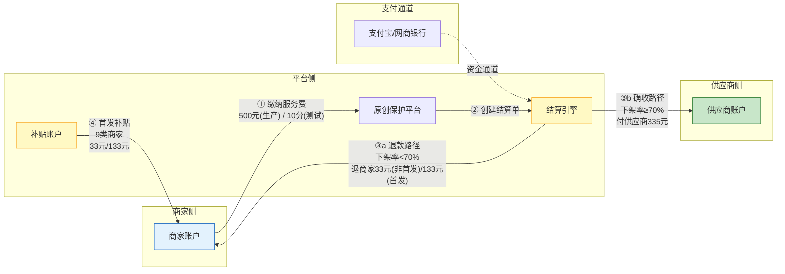
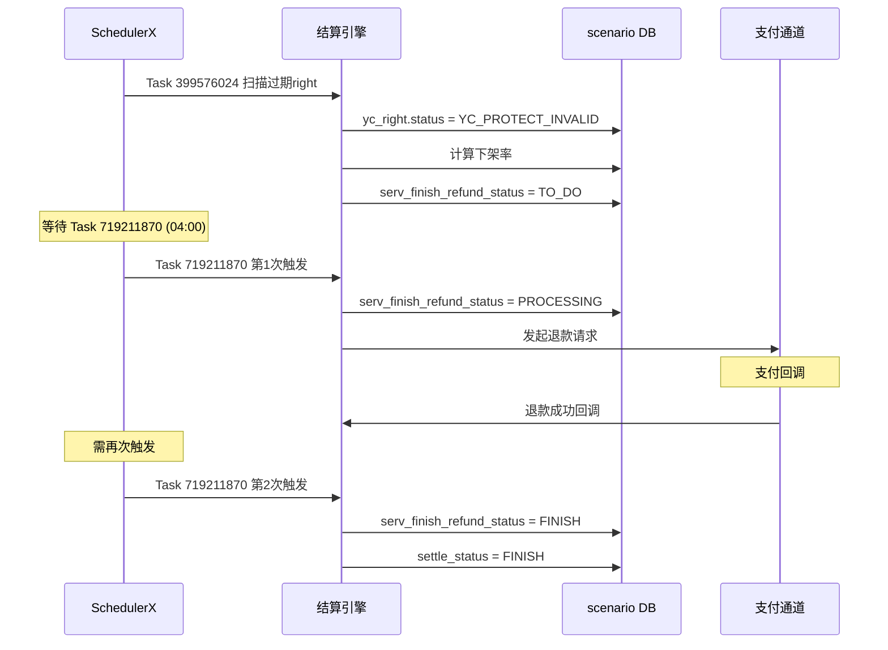
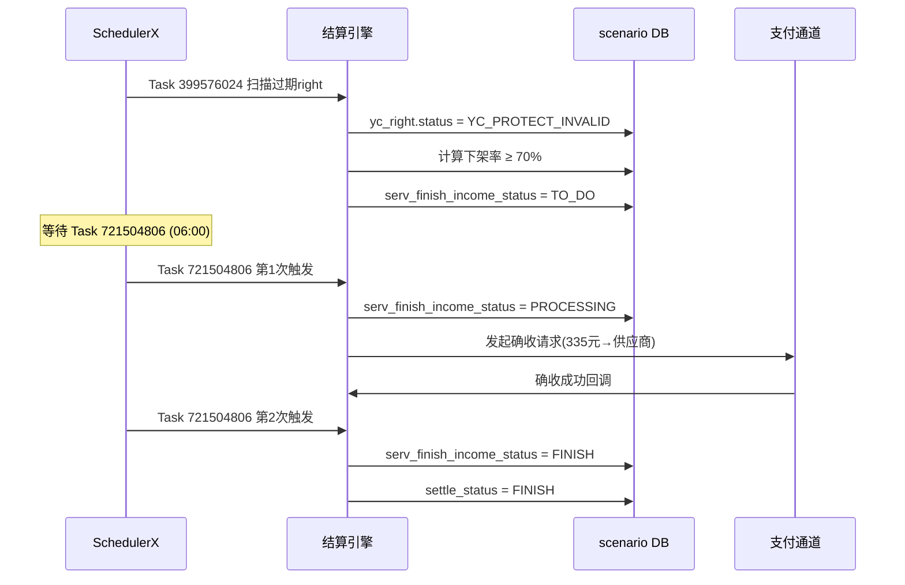
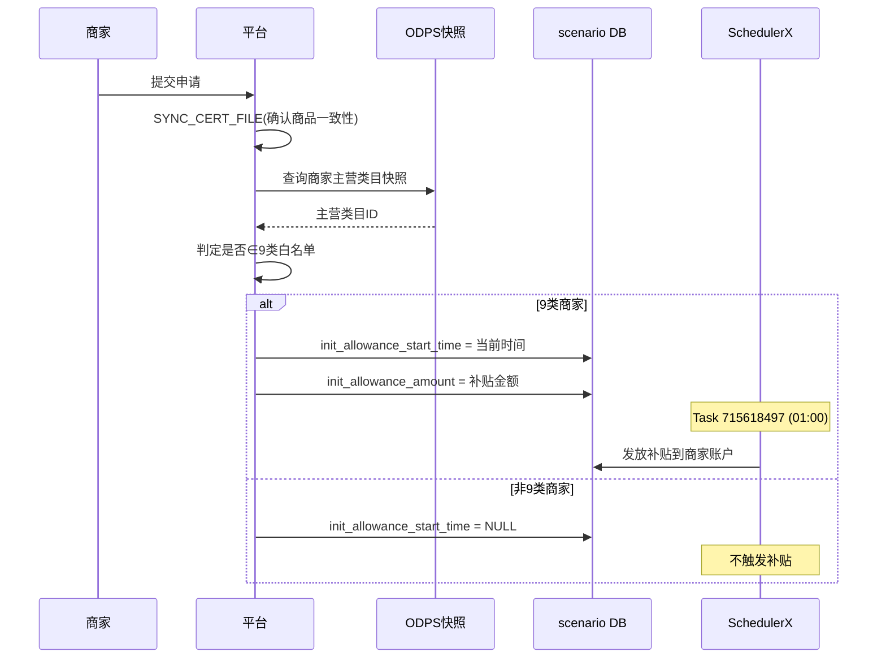

<!-- synced-from: /Users/caoxuemei/.qoderwork/plugins-custom/yc-protection-qa-workbench/skills/原创保护结算分析/references/fund-flow-model.md -->
<!-- synced-at: 2026-07-14T01:00:04.601894 -->
<!-- skill: 原创保护结算分析 -->

# 资金流向模型

## 角色定义

| 角色 | 说明 | 典型实体 |
|------|------|----------|
| 商家 | 缴费方，也是退款接收方 | seller_id=2213249110271（测试） |
| 平台 | 结算引擎运营方 | 原创保护平台 / 淘宝 |
| 供应商 | 确收接收方（维权服务方） | 维权服务商 |
| 支付通道 | 资金流转通道 | 支付宝 / 网商银行 |

## 资金流向总图



## 退款路径详细流向



## 确收路径详细流向



## 补贴路径详细流向



## 下架率计算

```
下架率 = SUCCESS(已下架)数 / 全部侵权记录数(含PROTECTING) × 100%
```

| 下架率 | 分流路径 | 资金方向 |
|--------|----------|----------|
| < 70% | 退款 | 平台 → 商家 |
| ≥ 70% | 确收 | 平台 → 供应商 |
| = 0%（无侵权记录） | 退款 | 平台 → 商家 |

### SQL 计算方式

```sql
SELECT 
    COUNT(CASE WHEN status = 'SUCCESS' THEN 1 END) AS taken_down,
    COUNT(*) AS total,
    ROUND(COUNT(CASE WHEN status = 'SUCCESS' THEN 1 END) * 100.0 / COUNT(*), 2) AS rate_pct
FROM yc_tort_record
WHERE right_id = {rightId} AND env = 'staging';
```
